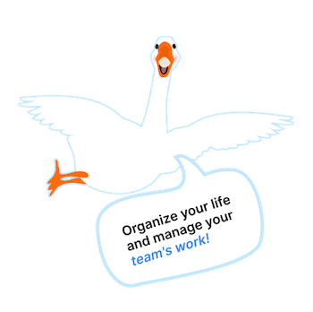

# Goose Track Team Project by "Push the Code"

## Front-end:

- [github pages](https://oleh-kliapko.github.io/GooseTrack_front/)
- [repository](https://github.com/Oleh-Kliapko/GooseTrack_front)
- [presentation](https://docs.google.com/presentation/d/1d3g74yDxrd6coeDDiTJY8KJxl7NWfo_Qv926hFcpHFg/edit#slide=id.gd5b15f0a3_5_26)

## Back-end:

- [repository](https://github.com/Oleh-Kliapko/calendar_server)
- [deploy server](https://calendar-server-g3h0.onrender.com)
- [swagger docs](https://calendar-server-g3h0.onrender.com/api-docs)

